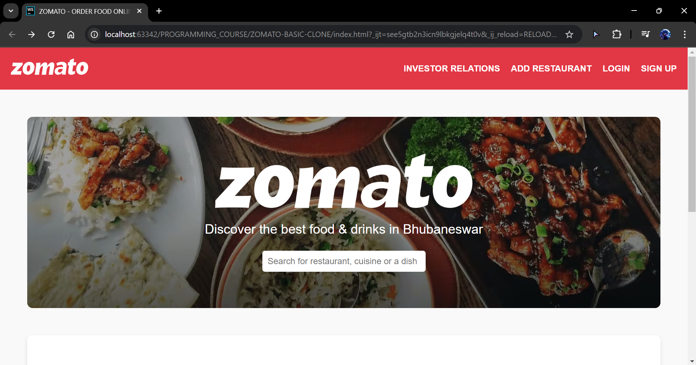
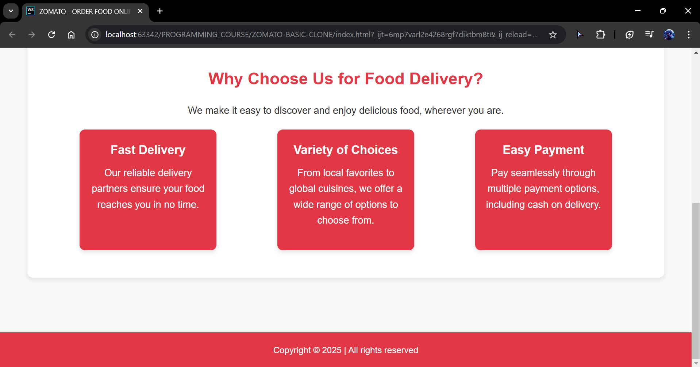

# Zomato Basic Clone

A simple web-based **Zomato Clone** that provides a visually appealing UI for a restaurant search and discovery platform. This project is built using **HTML, CSS, and JavaScript**.

## 📌 Project Overview
This project aims to replicate the fundamental design of Zomato's homepage with responsive UI elements. 
The goal is to practice **front-end web development** concepts and improve skills in structuring web applications and will make a complete 
clone with self added features in future in another project.

## 🏗️ Tech Stack
- **HTML** → Structuring web pages
- **CSS** → Styling and layout design
- **JavaScript** → Adding interactivity

## 📁 Folder Structure
```
ZOMATO-BASIC-CLONE/
│── IMAGES/              # Contains images used in the project
│    ├── bg.png          # Background image
│    ├── logo.png        # Logo image
│    ├── Screenshot1.png # Screenshot of the project
│    ├── Screenshot2.png # Screenshot of the project
│── index.html           # Main landing page
│── investor.html        # Additional page (e.g., investor info)
│── style.css            # Stylesheet for the project
│── script.js            # JavaScript for interactivity
│── README.md            # Project documentation (this file)
```

## 🌟 Features
- **Responsive Design:** Works across different screen sizes.
- **Navigation Bar:** Contains links to different sections.
- **Hero Section:** Displays a search bar with background image.
- **Feature Highlights:** Lists core functionalities (e.g., food delivery, dining, etc.).
- **Interactive Effects:** Hover effects, animations, and smooth transitions.

## 🚀 Installation & Usage
1. Clone this repository:
   ```sh
   git clone https://github.com/amansatya/ZOMATO-BASIC-CLONE.git
   ```
2. Open `index.html` in a browser.
3. Modify `style.css` or `script.js` as needed to customize the project.

## 📷 Screenshots
  


## ✨ Live Demo
[Click here to view](https://amansatya.github.io/ZOMATO-BASIC-CLONE/)

## 🎯 Future Enhancements
- Add **API integration** for real-time restaurant data.
- Implement **search filtering** for better usability.
- Enhance **mobile responsiveness**.

## 🤝 Contributing
Feel free to fork this repository, raise issues, or submit pull requests! 😊

## 📜 License
This project is for educational purposes and follows an open-source approach.

---
💡 **Developed by [Aman Satya](https://github.com/amansatya)**

